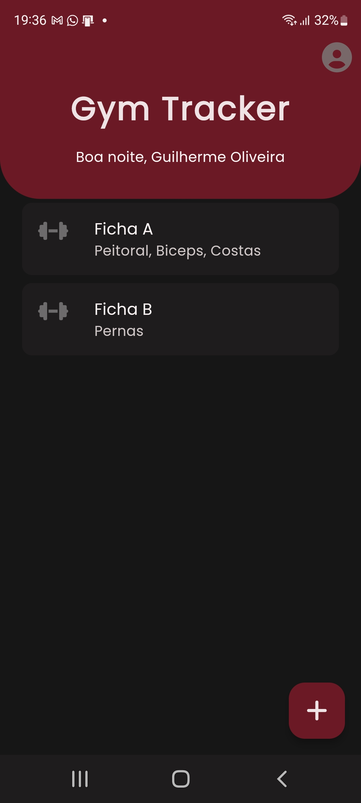
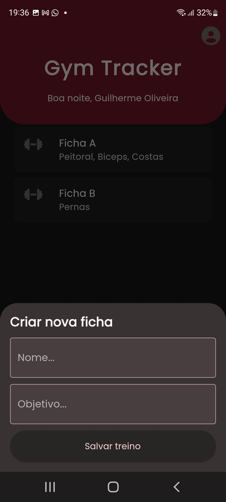
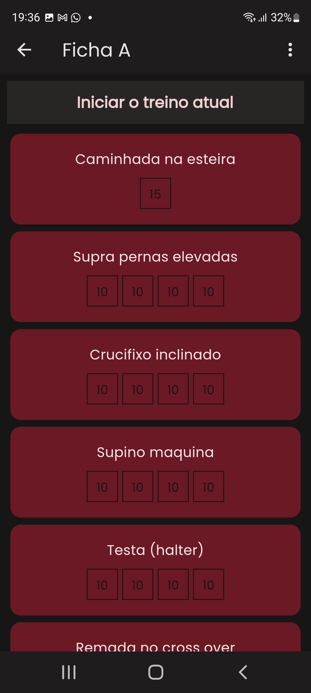
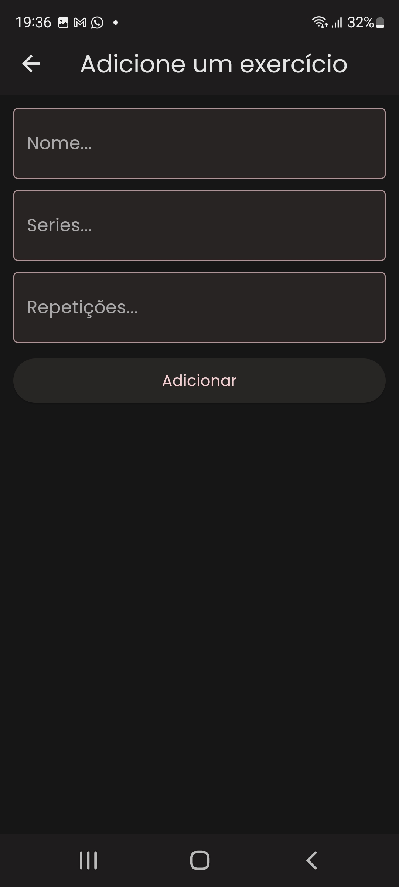

# Gym Tracker

## Objetivo

Esse projeto tem como objetivo criar um sistema de controle de academia, em que o usuário poderá cadastrar as suas fichas de treino com seus respectivos exercícios e acompanhar o seu progresso. Acima de tudo, tem como objetivo ser um projeto de estudo para mim, a fim de aperfeiçoar e colocar em prática os meus conhecimentos em desenvolvimento web e mobile.

## Stack

O projeto como um todo é relativamente simples, mas implementa boas práticas de programação para o backend e frontend da aplicação.

Para o backend, utilizei o framework *Spring* com a linguagem Java. Como dependência fundamental para este escolhi o modelo de programação reativa com o Spring Webflux, que é uma implementação reativa do Spring Web MVC. Para o banco de dados, utilizei o SQL server da Azure, que é um banco de dados relacional hospedado na nuvem.

Para o frotend, utilizei o framework *Flutter*. Implementei o código sem nenhum tipo de gerenciador de estado. O aplicativo é tolerável a falhas de conexão com o backend.

## Funcionalidades

O usuário pode cadastrar e visualizar suas fichas de treino na primeira página. Ao clicar em uma ficha, o usuário pode visualizar os exercícios que estão nela e cadastrar novos. Além disso, é possível iniciar um treino e visualizar o progresso dele.

## Imagens

Página inicial

Criar ficha

Visualizar ficha

Adicionar exercícios

